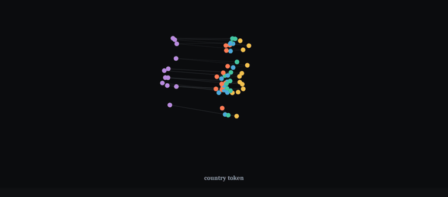

# Las operaciones relacionales se factorizan de sus operandos en LLMs

<p class="hero-sub">¿Cómo representa un modelo de lenguaje <i>"la capital de Italia"</i>?
Encontramos que divide el pensamiento en dos: <b>la cosa</b> (Italia) y <b>la operación que se le
aplica</b> (capital-de) — y la operación vive como su propia <b>dirección</b> en el espacio de
activaciones: se la puede agarrar, mover y trasplantar.</p>

## El hallazgo, conceptualmente

El latín marca el *rol* de un sustantivo con una desinencia — `ros-a / ros-am`, misma raíz,
distinta función. A mitad de la red, un LLM hace algo estructuralmente similar con las
relaciones factuales. Mientras *"The currency of Italy is"* fluye por el modelo, el estado
interno de la oración se describe bien como una suma:

```
estado ≈ μ + operando(Italia) + operador(moneda-de) + interacción pequeña
```

Tres cosas hacen que esto sea más que un ajuste de curvas:

1. **El operador es causal.** Sumá la diferencia de direcciones `v(capital) − v(moneda)` al
   residual stream y el modelo deja de decir *euro* y dice *Roma* — para **todos** los pares
   ordenados de relaciones que probamos. Una dirección aleatoria del mismo tamaño no hace nada.
2. **Transfiere.** Construido con la mitad de los países, flipea la otra mitad. Construido con
   una redacción, flipea paráfrasis que nunca vio. Construida la receta en Qwen, funciona igual
   en Gemma.
3. **La operación no es su palabra de salida.** *Idioma-de* y *gentilicio-de* terminan ambas en
   "Italian" — y sin embargo son direcciones distintas, y un marcador construido exactamente
   donde las dos comparten la palabra sigue instalando la relación. El modelo separa el rol
   gramatical de la forma superficial, como la declinación separa el caso de la desinencia
   (*sincretismo*).

Y el límite es igual de informativo: corré el mismo pipeline sobre **aritmética** (+, ×, −) o
**lógica de comparación**, y el operador queda entrelazado con sus operandos y se niega a
transferir — consistente con "la aritmética como bolsa de heurísticas", y evidencia de que la
factorización limpia es una propiedad de la *recuperación relacional*, no del prompting en
general.

<div class="hero-gif" markdown>
[](explorer.md)
</div>

<div class="hero-buttons" markdown>
[:material-play-circle: Resultado interactivo](explorer.md){ .md-button .md-button--primary }
[:material-file-document: Paper (PDF)](assets/paper.pdf){ .md-button }
[:material-flask: Evidencia y controles](robustness.md){ .md-button }
[:material-github: Código](https://github.com/mpodeley/jspace-qwen){ .md-button }
</div>

## Los números

<div class="stats" markdown>
<div class="stat"><span class="n">20/20 × 3</span><span class="d">swaps ordenados de operador
cambian la respuesta en Qwen3-1.7B, Qwen3-8B y Gemma-2-9B; controles aleatorios ≈ 0</span></div>
<div class="stat"><span class="n">82–86%</span><span class="d">de la varianza del workspace en el
token de consulta es el operador; la interacción ("fusión") queda en un dígito</span></div>
<div class="stat"><span class="n">180/180</span><span class="d">flips con operandos held-out y
paráfrasis nunca vistas — un operador transferible, no interpolación</span></div>
</div>

Todos los efectos principales llevan IC bootstrap 95% a nivel de operador y ninguno cruza cero —
ver [Evidencia y controles](robustness.md): cada claim junto al control que podía matarlo.

!!! note "Nota metodológica — el null honesto que originó esto"
    Este proyecto empezó como réplica del claim de legibilidad del J-space / global workspace
    ([Gurnee, Sofroniew, Lindsey et al., 2026](https://transformer-circuits.pub/2026/workspace/index.html)).
    Bajo controles apareados (incluida una proyección aleatoria de espectro igualado), el
    **readout del J-lens no superó al logit lens** en ninguna métrica. La estructura de arriba es
    organización *causal*, no un subespacio privilegiadamente legible — la mitad negativa está
    documentada con el mismo rigor en el [archivo](method.md) y la [bitácora](findings.md).

---

**Reproducibilidad.** Todo corre en una sola APU AMD Strix Halo (sin CUDA). Semillas,
checkpoints exactos (`Qwen/Qwen3-1.7B`, `Qwen/Qwen3-8B`, `google/gemma-2-9b`), artefactos
long-form por operando y el generador de cada figura están en el repo — ver
[Cómo reproducir](reproduce.md). Licencia MIT · Matias Podeley · <mpodeley@gmail.com> ·
[Cómo citar](https://github.com/mpodeley/jspace-qwen#how-to-cite)
