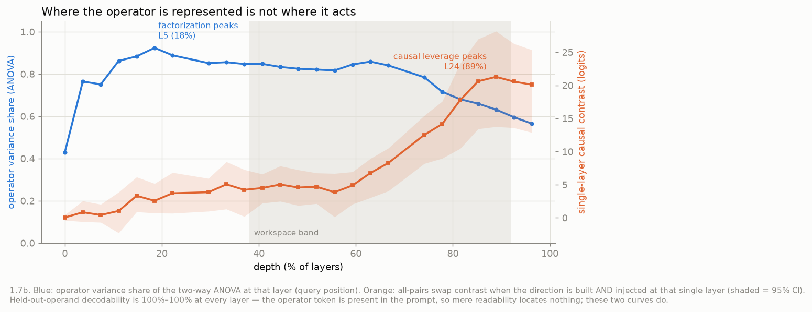

# Operator–operand factorization in LLM residual streams: causal influence and compositional sufficiency

*Subtitle: three levels of evidence — the relational operator exists as a stable direction, it
causally controls the answer margin, and a state composed from the factorization's parts makes the
model produce the answer. A closing discussion offers declension as the organizing metaphor.*

[:material-file-document: Download the PDF](assets/paper.pdf){ .md-button .md-button--primary }
[:material-play-circle: Interactive explorer](explorer.md){ .md-button }

*Draft, 2026-07-10. Qwen3-1.7B/8B + Gemma-2-9B. All numbers reproducible from `scripts/` and `data/`; see
["How to reproduce"](reproduce.md) and the [working findings log](findings.md). An
[interactive explorer](explorer.md) animates the three central results (declension, injection,
syncretism) and, for readers new to grammatical case, explains the linguistic analogy.*

## Abstract

How do language models represent a relational operation — *currency-of*, *capital-of* — as distinct
from the entity it applies to? We separate three levels of evidence. **Representation:** a two-way
ANOVA factorizes the mid-network state as `H ≈ μ + operand + operator + interaction`, ~90% additive
across Qwen3-1.7B/8B and Gemma-2-9B — and the steering vector is *identically* the ANOVA operator
component. **Causal influence:** adding `v(op_B) − v(op_A)` flips the target-vs-source logit margin for
all ordered relation pairs in all three models; the query token alone matches the full-prompt effect at
60× lower off-task cost, and the decisive nulls — directions rebuilt under **permuted relation labels**,
and random directions **inside the operator subspace** — abolish the effect. **Behavioral sufficiency:**
a state *composed* from the factorization's parts, `μ + operand + operator`, patched at one position,
makes the model *produce* the target answer at its own competence ceiling (52% vs. 53% clean;
leave-one-out components reach 36%, and swapping the operand component redirects the answer). The
interaction term is unnecessary — and the earlier failure of additive steering to generate is a **dose
artifact**: at the calibrated dose the same direction generates at ceiling, while overdosing keeps
inflating the margin as it pushes the state off-manifold. The structure generalizes (held-out operands,
re-framed and re-lexicalized prompts, an independent animal-taxonomy domain), separates the operation
from its surface realization (*language-of* ≠ *demonym-of* despite both emitting "Italian"), and does
not emerge for arithmetic or logic under the identical pipeline. Relational computation here is an
operand plus a transplantable operator — sufficient, not merely influential, where the answer is
decided.

## 1. Introduction

When a language model completes *"The currency of Italy is—"*, does it represent
*currency-of-Italy* as one fused thing, or as an entity plus an operation applied to it? This paper
argues, causally, for the second reading — and asks the question a claim like that must answer at
**three separate levels of evidence**: **representation** (does a stable relational direction *exist*,
separable from the operand?), **causal influence** (does intervening on it systematically move the
model's *relative preference* between answers?), and **behavioral sufficiency** (can the factorized
parts make the model actually *produce* the target answer?). Distinguishing the levels matters because
interventions that move a logit margin are routinely read as if they controlled behavior, and the gap
between the two is where interpretability claims quietly overreach. Here that gap becomes the object of
study — and resolves: we show it is a property of *how* the direction is applied (mode and dose), not
of *what* it contains.

A line of work shows that a *task* or *relation* can be captured by a single addable vector in an LLM's
residual stream (task vectors, Hendel et al. 2023; function vectors, Todd et al. 2024) and that many
relations are approximately linear operators (LRE, Hernandez et al. 2024; Merullo et al. 2024). What has
not been characterized is the **joint structure of operator and operand**: whether the operation
*factorizes* from its argument, *generalizes*, is separable from the *word it produces*, and suffices to
*drive generation* — and whether any of this holds beyond relational facts. We answer these on Qwen3 and
Gemma-2, across a geographic and an animal-taxonomy domain, with arithmetic and logic as the contrast.
A closing discussion (§5) offers **declension** as the organizing metaphor for the asymmetries observed.

## 2. Related work and what is new here

**Extracting relational concepts.** The closest prior work is Wang et al. (2024), who locate hidden
states that express a relation separately from its subject, transplant these relational representations
between subjects, and rewrite relations across 22 relation types and several models. We instead
characterize the **joint geometry** of relation and entity: we quantify its additive and interaction
components (the two-way ANOVA with a measured fusion term), run exhaustive all-pairs swaps against
matched-norm nulls, and test whether relation directions generalize causally across held-out entities,
prompt contexts, architectures, and task domains — including the domains where the factorization fails.

**Operation as an addable vector; relation as a linear operator.** Task Vectors (Hendel et al., EMNLP
2023) and Function Vectors (Todd et al., ICLR 2024) extract one vector per ICL task and add/patch it to
trigger the task (similarly In-Context Vectors, Liu et al., ICML 2024; ActAdd, Turner et al. 2023) —
but bundle operator *and* operand into one unfactored "task" direction, without competitive nulls. LRE
(Hernandez et al., ICLR 2024) fits a full affine map per relation — a *monolithic* operator. Summing Up
the Facts (Chughtai et al. 2024) decomposes factual recall into additive *circuits*; ours is a two-way
ANOVA of the **residual state itself**, with a measured interaction term and a sufficiency test on the
components.

**Attribute subspaces / reading position.** RAVEL (Huang et al., ACL 2024) disentangles multiple
*attributes of one entity* into subspaces (operators sharing an operand); we measure the orthogonal
axis, **operator vs operand**. The operand→operator shift along the sequence restates the
subject-enrichment → attribute-extraction dynamics of Geva et al. (EMNLP 2023) in operator/operand
terms — our least novel point, included as confirmation.

**Global workspace and the Jacobian lens.** Gurnee, Sofroniew, Lindsey et al. (2026) introduce the
Jacobian lens and identify a mid-depth "global workspace" band. We adopt their depth band as the site of
intervention; our contribution is orthogonal — the operator/operand structure of what the band *holds* —
and we report a controlled null on the lens's readout advantage for our task (§4.9).

**Arithmetic and logic.** LLM arithmetic is reported as a "bag of heuristics" (Nikankin et al. 2025)
and Fourier/helical procedures (Nanda et al. 2023; Zhong et al. 2023; Kantamneni & Tegmark 2025), with
the operand *value* cleanly linear (Gurnee & Tegmark 2024); truth is steerable (Marks & Tegmark 2023)
and logical-operator heads exist (Hong et al. 2024). No prior work reports a **cross-domain
operator/operand factorization**; we provide one and show where it does not emerge.

**What is new here is the combination, not any single ingredient.** That relations admit addable
vectors and linear decoders is established; what has not been done is the joint, quantified analysis:
the operator ⊕ operand **factorization of the residual state itself**, with the steering vector shown
to *be* the ANOVA operator component; the all-pairs swap validated against **permuted-label and
within-subspace nulls**; **held-out-operand generalization**; the **compositional sufficiency** test
(does a state assembled from the parts *generate*?) with its dose × position calibration; the
**operation-vs-realization dissociation**; and the **cross-domain test** (each claim, its evidence, and
its decisive control are tabulated at the head of §4). The declension reading is our *presentation* of
these measurements, not an additional empirical claim.

## 3. Method

**Setup.** Qwen3-1.7B/8B throughout, plus Gemma-2-9B for the cross-architecture replication (§4.7); all
run in bf16 on a single AMD Strix Halo APU (environment details in the supplementary repository). A relation is rendered into a template; the canonical frame is
`"The {op} of {a} is"`, and §4.5 additionally uses two paraphrase frames (question–answer and
discourse-prefixed) that hold the `{op} of {a}` unit fixed while varying the surrounding frame, all
ending in *is* so answer scoring is comparable.
Reading position is the query token unless stated; the depth "workspace" band (38–92% of layers) is where
the J-space paper locates the global workspace and where we build operator directions.

**Notation.** The model's state is a grid `h_{ℓ,t} ∈ R^d`: one residual-stream vector per layer `ℓ` per
token position `t`; every measurement fixes both indices. Two reading positions recur: the **entity
token** (the operand's last subword, `t = −2` in the canonical frame) and the **query token** (the final
prompt token, `t = −1`, where the next-token prediction is read; "query" means reading position, not
attention's Q). Rendering the operator–operand grid through one template gives, at each `(ℓ, t)`, a
family of states `h_{ℓ,t}(o, k)`.

**Operator direction ≡ factorization component.** For operator `k`,
`v_ℓ(k) = mean_o[ h_{ℓ,−1}(o, k) − mean_{k'} h_{ℓ,−1}(o, k') ]` — one direction **per layer** of the
workspace band (13 layers per model), the function-vector construction. This is *algebraically
identical* to the operator main effect of the two-way factorization below
(`b_ℓ(k) = mean_o h_{ℓ,−1}(·,k) − μ_ℓ`), and we verify the identity numerically (max relative
deviation 8.5×10⁻⁸ across the band). Everything the paper does — steering, composing, decoding —
manipulates this one object; the differences between experiments are differences in *how it is
applied*, never in what is extracted.

**Factorization.** At a fixed `(ℓ, t)`: `h = μ + a(o) + b(k) + e(o, k)` — operand main effect,
operator main effect, and interaction, exact by construction (the interaction is the cell residual),
every term carrying the `(ℓ, t)` indices; we report the variance share of each term (Appendix A).
Table 1 uses the mid-workspace layer — **layer 17 of 28 (63% depth) at 1.7B, 23 of 36 at 8B, 27 of 42
on Gemma-2-9B** — at `t = −1` and, as the control, `t = −2`.

**Swap, positions, and controls.** Efficacy of `k_A → k_B` is the change in
`logit(answer_B) − logit(answer_A)` at the query position when `α·(v(k_B) − v(k_A))` is added — over the
band or a single layer, at all prompt positions or a chosen one (all / query / operand /
sentence-initial control). Beyond the **matched-norm random** direction, the null battery includes
directions rebuilt under **permuted relation labels** (per-operand and global — same statistics, no
semantics: the decisive null), random directions **inside the operator subspace**, the correct direction
at the **wrong layer** and **wrong position**, an **other-relation** direction of matched norm, and
**shuffled-answer** scoring. Every intervention reports margin change, normalized margin, target rank
before/after, top-1, greedy exact match (3 tokens), on-task KL, and off-task KL on unrelated WikiText —
not flips alone. Answers are scored at their distinguishing first token (bare digit for arithmetic); a
tokenization guard drops, per operator pair, operands whose answers collide there (4 of 12 survive on
the syncretic demonym↔language pairs; all 12 elsewhere).

**Composition (behavioral sufficiency).** The factorization's component vectors, computed per layer,
are recombined and **replace** the residual at the query position (`μ+operator`, `μ+operand`,
`μ+operand+operator`, `μ+interaction`, the full donor, a norm-matched magnitude control) — plus two
loophole-closers: a **leave-one-cell-out** reconstruction whose components never saw the target cell,
and a **wrong-operand** composition that should (and does) redirect the answer. The generation readout
("says X") is **containment, not literal exact match**: the greedy continuation contains the gold
answer case-insensitively, so *the euro*, *euros*, and *Euro* all count for *euro*; the model's own
clean accuracy under the same readout is the ceiling. A generation **audit** (Appendix A) extends this:
longer decodes, a five-way classification of every raw generation (target / source / right-relation-
wrong-entity / wrong-relation / degraded), and a **forced-choice** score — length-normalized full-
sequence log-probability among the operand's gold answers under the same intervention — which is immune
to article interception and multi-token surface variants.

**Generalization and domains.** Build `v(op)` from half the operands; test the swap on the held-out
half — a genuine operator vs. interpolation among build examples. Domains: five country relations
(currency, capital, language, demonym, continent × 12 countries), an independently curated
**animal-taxonomy domain** (class, habitat, diet, covering × 12 animals; stable 1-to-1 answers,
tokenizer-screened, three paraphrase frames), and arithmetic / comparison logic as the contrast domains.

**Statistical treatment.** The ordered swaps are **not** independent observations: they share operator
directions and operands. We report cluster-bootstrap percentile intervals (10,000 replicates) at two
levels: within a pair the **operand** is the resampling unit; across the paradigm the **operator** is
the top-level cluster (a dyadic node bootstrap — resample operators with replacement, weight each pair
by its endpoints' multiplicities, resample operands within surviving pairs). Per-operand values are
released as long-form artifacts (Appendix A).

**J-space controls.** We repeat readout-geometry in the J-lens readout `unembed(J·h)` vs the logit-lens
readout `unembed(h)`, and re-run efficacy with **spectrum-matched random-projection** and
**permuted-vocabulary** null lenses (Appendix B).

## 4. Results

Each experiment below tests one claim against the control that could kill it:

| claim | main evidence | decisive control | scope |
|---|---|---|---|
| a stable operator direction exists | ANOVA ~90% additive; `v(op)` ≡ main effect (§4.3) | reading-position control | 9 relations, 3 models |
| it causally controls the margin | all-pairs swaps flip, 3 models (§4.1) | **permuted labels → 0**; subspace-random → 0 | relative preference |
| the effect is localized | query token ≈ all positions, 60× lower KL (§4.1) | operand / sentence-initial positions ≈ 0 | both Qwen3 scales |
| the operator generalizes | held-out operands; re-framed, re-worded prompts (§4.5) | random ≈ 0; transfer ≈ within | relations + animals |
| the parts **suffice to generate** | composed patch ≈ donor ≈ ceiling; calibrated steering (§4.2) | leave-one-out; wrong-operand; magnitude; interaction | greedy, this setup |
| the factorization is domain-scoped | animals replicates; arithmetic/logic do not (§4.8) | held-out fails off-relation | our setup (§4.8) |

### 4.1 Relational operators are causally manipulable — and the effect is localized and label-specific

All 20 ordered operator swaps flip the **target-vs-source logit margin** while the matched-norm random
control is ≈ 0. Under the operator-level cluster bootstrap (§3), the swap−random contrast is **+22.6,
95% CI [+14.0, +32.1]** at 1.7B, **+26.0 [+17.9, +32.8]** at 8B, and **+30.4 [+23.8, +34.8]** on
Gemma-2-9B; the flip fraction is **1.00 [1.00, 1.00]** in all three. Per-pair operand-bootstrap CIs
never cross zero, and the weakest pairs are exactly the syncretic ones (demonym ↔ language, which share
their surface form; per-pair distributions in Appendix A).

**Where the vector has to land (1.7B, α = 4).** Injecting at the **query token alone** reproduces the
all-position effect on the margin — at 60× lower off-task cost:

| position, scope | Δmargin [95% CI] | rank(tgt) | says target | KL off |
|---|---:|---:|---:|---:|
| all, band | +28.9 [+16.2, +39.9] | 431 | 0.4% | 18.4 |
| **query, band** | +28.7 [+16.1, +39.8] | 368 | 2.2% | **0.29** |
| query, one layer | +13.7 [+7.7, +18.3] | **69** | 9.8% | 0.04 |
| operand, band | +1.8 [+1.0, +2.5] | 3194 | 0.4% | 0.26 |
| wrong (t = 0), band | +2.3 [−0.2, +4.8] | 194 | 3.6% | 1.56 |

The margin effect is a **localized edit of the queried relation** — position-specific (the operand
token and a structurally irrelevant token do essentially nothing; sign-correct 98/98/91% for the three
effective rows vs. 4–16% for the controls) and nearly free off-task when restricted to the query
position — not a global perturbation of processing. The battery replicates at 8B (query-only +32.7 vs.
all-positions +33.2, at 63× lower off-task cost). (Ranks are medians, clean baseline 570; n per
condition is 224 cells; bootstrap unit in §3.)

**The label is everything.** Directions rebuilt from the *same* residuals with **permuted relation
labels** — preserving every statistical property of the extraction while destroying its semantics —
abolish the effect: **+0.7 [−0.8, +3.9]** per-operand, +0.6 global (20 redraws each; at 8B +0.15 and
+0.09 against a real contrast of +26.0). A random direction **inside the operator subspace** (right
subspace, wrong content) also does nothing: +0.75 [−2.2, +3.5] (8B: +0.43).
Three further probes stay nonzero for *mechanistically informative* reasons, and decompose what the
margin measures: an **other-relation** direction retains the shared `−v(source)` component and yields ≈
half the effect (+11.1 — uninstalling the source is half the margin); **shuffled-answer scoring** still
moves (+21.1) because `+v(target)` boosts the whole answer *category* (any capital city, not
specifically Rome) — operand specificity lives in generation, which §4.2 measures directly; and the
correct direction at the **wrong (early) layer** retains +9.8 because residual-stream additions
*persist* downstream — per-layer locality is measured properly in §4.6. (Forest plot in Appendix A.)

**Dose–response, both signs.** The effect is a **signed causal axis**: the operator-specific shift is
monotone in α through zero and *reverses* with the direction — +22.6 at α = +4 vs. **−21.0 at α = −4**,
an almost exact mirror (8B: +26.0 vs. −24.5), saturating at both ends (the positive branch higher, +29 vs. −15 raw, because
the clean margin already favors the source: a floor) — while the random control's shift (≈ +6) is flat
in |α|, which is why every headline number is a swap − random contrast. Off-task cost grows with dose
and breadth (7.9 → 21 nats/token band-wide vs. 0.29 at the query token). What dose does to *generation*
is the subject of §4.2. (Curves in Appendix A.)

### 4.2 A state composed from the factorization's parts generates the answer

At the default dose, additive steering flips every *margin* but rarely makes the model *say* the target
answer (0.4–2.2% exact match), whereas replacing the query-position residual with a **real donor
activation** (same operand, target relation) does — 51%, at the model's clean accuracy of 53%. Is the
donor carrying something the direction lacks — operand binding, a non-additive interaction, lexical or
execution signals? We decompose the donor by the exact factorization and patch partial reconstructions
at the query position (every variant includes μ: the hook *replaces* the state, so a variant must be a
plausible full-magnitude residual). 1.7B, 224 (pair, operand) cells:

| patched state | says target | says source | says other | rank(target), median | top-1 |
|---|---:|---:|---:|---:|---:|
| magnitude control (μ + norm-matched random) | 4.5% | 33.5% | 0.0% | 696 | 0% |
| interaction only (μ + inter) | 7.1% | 35.3% | 0.0% | 166 | 0% |
| operand only (μ + operand) | 7.6% | 37.5% | 0.0% | 54 | 0% |
| operator only (μ + operator) | 20.1% | 14.7% | 1.8% | 71 | 0% |
| **operator + operand (μ + both)** | **51.8%** | 13.4% | 1.8% | **2** | 31.7% |
| operator + operand, **held-out cell** | **35.7%** | 18.8% | 1.8% | 5 | 17.9% |
| operator + **wrong** operand | 20.1% | 11.6% | **34.4%** | 206 | 0% |
| full donor (μ + both + inter) | 50.9% | 12.5% | 1.8% | **2** | 31.2% |

**The donor carries nothing the additive parts don't.** The purely additive composition
`μ + operand + operator` generates at the donor's own level (51.8% vs. 50.9%) — the model's competence
ceiling — while the interaction term alone does nothing (7.1%, vs. 4.5% for the magnitude control).
Two controls close the loopholes. A **leave-one-cell-out** reconstruction, whose operand and operator
components were built *without ever seeing the target cell*, still generates at 35.7% — composition,
not leakage. And swapping in a **wrong operand's** component redirects the answer to *that* operand
(34.4% says-other vs. 1.8% baseline): the state is compositional in exactly the way the factorization
claims — the operator component selects the relation, the operand component selects whose answer. At
**8B every number sharpens**: composed 62.1% vs. donor 65.2% (clean ceiling 68%), leave-one-out
**50.4%**, wrong-operand redirect **48.2%**, interaction-only 3.6%, magnitude control 2.2%.

*What the donor patch carries. Left: does the model SAY the target answer (behavioral sufficiency)?
Right: does it prefer it (margin)? The additive composition (blue) matches the real donor (orange);
everything else is a control.*

**Sufficiency by steering, at the calibrated dose.** Since `v(op)` *is* the operator component (§3),
adding `α·(v(B) − v(A))` at the query position of one layer lands, at α = 1, on
`μ + operand + operator(B) + interaction(A)` — the composed state up to a wrong interaction term. The
dose sweep confirms it behaviorally: generation follows an **inverted-U peaked exactly at the
on-manifold dose** — 38.4% at α = 1 for a single layer, **51.3% at α ≈ 0.1 for the 13-layer band**
(band additions accumulate, so the band's on-manifold dose is ≈ 1/13 per layer; the same peak doses
reproduce at 8B: 45.1% and 56.2%) — while past the peak the margin keeps climbing (+28.9 at α = 4) as
generation collapses. The earlier "steering moves margins
but cannot generate" result was an **overdose artifact**, not an information deficit: the factorized
representation is **compositionally sufficient**, by replacement and by calibrated addition. (At a
single layer, `μ + operator` alone already generates at 44.6% — unpatched layers still carry the
operand, so the injection point is local and operand identity distributed.)

**The generation audit** (Appendix A) closes the metric loopholes directly. Classifying every raw
k = 8 generation: the calibrated dose produces the *fluent, correct* answer (59.4% target vs. 0.9%
source; composed patch 57.6% — both at the clean prompt's own 58.5%), while at the overdose **94.6% of
generations are degraded token loops** by manual inspection — category-correct, fluency-destroyed, not
surface variants the metric missed. A **forced-choice** readout (full-sequence log-prob among the
operand's gold answers, under the intervention) then dissociates information from fluency: the target
wins at **80.4% even at the overdose** (87.5% calibrated, 84.4% donor patch, 2.7% clean). Overdosing
destroys the generation manifold, not the encoded preference.

### 4.3 The representation factorizes into operator ⊕ operand

Does the state literally decompose into "the thing" plus "the question asked about it"? Two-way ANOVA
of `h_{ℓ,t}(o, k)` at the mid-workspace layer (L17/28 at 1.7B, L23/36 at 8B; §3) — one decomposition
per reading position:

| read position | operand | operator | interaction (fusion) |
|---|---:|---:|---:|
| query token | 5% / 6% | **86% / 82%** | 9% / 13% |
| entity token | **59% / 55%** | 31% / 34% | 9% / 11% |

~90% additive; operand and operator components occupy distinct subspaces (principal angles 41–85° at
the query token — though near-orthogonality is the high-dimensional default, so the load-bearing
evidence is the variance split and the causal results). Since the steering vector is numerically this
ANOVA's operator main effect (§3), the direction that flips margins (§4.1), the component that composes
into a generating state (§4.2), and the term that dominates this split are **one vector seen three
ways**. The operator-dominant representation **emerges along the sequence**: the entity enters
operand-dominant and is re-marked by its queried role at the query position (the reading-position
control rules out template echo).

(A PCA of the 60 workspace states, showing the operand-organized cloud at the entity token reorganizing
into operator clusters at the query token, is in Appendix A.)

### 4.4 Operation ≠ realization (syncretism)

*language-of* and *demonym-of* emit the **same word** (Italian) yet are **distinct operator
directions**; the swap between them is weak precisely because they share their output word. An
**exponent-free operator marker** built from the shared-output pairs (`mean[h(language) − h(demonym)]`,
the output word cancelled by construction) still installs the relation causally (1.7B: −3.6 → +12.5):
the operator representation is not an output-word representation (§5 reads this as syncretism).

(Operator-direction cosines and the exponent-free-marker bar chart are in Appendix A.)

### 4.5 Operators generalize: held-out operands, prompt frames, wordings — and a second domain

**Held-out operands.** `v(op)` built on 6 operands and applied to the 6 held-out still flips **20/20**
swaps — a transferable operator, not interpolation: contrast **+20.0 [+10.8, +29.5]** at 1.7B, **+22.8
[+14.0, +31.0]** at 8B, flip fraction 1.00 at both.

**Frames and wordings.** Rendering every relation in three paraphrase frames and testing every
build→test combination: on 1.7B **all 9 combinations flip 20/20** (180/180), *frame-invariant to two
decimals* (+22.6 on all three test frames); at 8B 100/100 with the same invariance. Stronger: the
direction survives changing the *wording of the relation itself* — re-lexicalizing every relation
(*currency of* → *money used in*, …) and transferring both ways gives **40/40 at both scales**, with
transfer ≈ within-formulation (+22.59 vs. +22.62 at 1.7B). Clean baselines shift across frames and
wordings; the operator's causal effect does not: it is a property of the **relation**, not its wording.

**A second, non-geographic domain.** Every signature replicates on an independently curated
animal-taxonomy domain (class / habitat / diet / covering × 12 animals; 1.7B): **12/12** ordered swaps
flip (+18.1 [+13.5, +22.8]); held-out operands **12/12** at +18.0 — transfer indistinguishable from
within; cross-frame **72/72**, again frame-invariant to two decimals; permuted-label and subspace nulls
at zero (−0.5 and +0.2, CIs spanning 0); the same reading-position signature (operand 79% at the entity
token, operator 62% at the query token); and even the same quantitative margin decomposition (the
other-relation probe retains ≈ half the effect in both domains: 47% vs. 49%). Two honest caveats: the
animal factorization carries more interaction (22% vs. 9% — informative in §4.8), and the
generation-level readout is floor-limited here (the model's own clean greedy accuracy on these
multi-token answers is 6%), so in this domain sufficiency is attested by margins and rank, not exact
match.

### 4.6 Where the operator is represented is not where it acts

A per-layer sweep (1.7B; direction built **and** injected at each single layer) separates three notions
the band framing conflates. *Trivial readability:* a held-out-operand classifier decodes the operator at
**100% from every layer, including layer 0** — the operator's token is in the prompt, so decodability
locates nothing. *Representation:* the ANOVA operator share peaks **early** (92% at 19% depth), decaying
to 57%. *Causal leverage:* the single-layer swap contrast is ≈ 0 early and peaks **late** (+21.3
[+13.8, +28.2] at 89% depth — one layer there reproduces the full band's +22.6). The two informative
curves peak **70 depth-points apart** (8B: 23% vs. 89% — the same profile): where the operator is most
cleanly factorized is not where injecting it most moves the output. This explains the wrong-layer probe of §4.1 (early additions act by
persisting into later layers) and diagnoses the mid-band layer of §4.1–4.2 as far from optimal (L17:
+6.8 vs. L24: +21.3): being *readable*, being *the representation*, and being *causally potent* are
three different layer profiles of one direction. (Figure in Appendix A.)

### 4.7 Cross-architecture replication (Gemma-2-9B)

The entire pipeline transfers unchanged to **Gemma-2-9B** — a different pretraining corpus, tokenizer
(SentencePiece; answer single-token coverage 0.95), and architecture family (soft-capped logits, GQA).
Every qualitative signature replicates, with the strongest effects of the three models: all-pairs
contrast **+30.4 [+23.8, +34.8]** (20/20 flips), held-out **+26.6 [+20.6, +33.2]**, operator variance
84.8% with **6.8%** interaction, and the exponent-free marker −3.0 → +8.5 (full three-model table in
Appendix A). Raw logit units are not directly comparable across architectures (Gemma-2 soft-caps its
final logits), so cross-model comparison should lean on flip rates and variance shares, which match or
exceed Qwen3's: the factorization is not an idiosyncrasy of one model family.

### 4.8 Domain scope: a second retrieval domain replicates; arithmetic and logic do not emerge

If the factorization were an artifact of prompting, it should appear wherever the prompt has the same
shape. It does not. Extending the identical pipeline to arithmetic (+, ×, −) and comparison-logic
operators, on 1.7B, with the animal domain (§4.5) as the second retrieval column:

| domain | op var | fusion | held-out | swap/rand |
|---|---:|---:|---|---|
| **countries** | 86% | 9% | **20/20** | +21 / ~0 |
| **animals** | 62% | 22% | **12/12** | +19 / +0.7 |
| arithmetic | 55% | 23% | 2/6 (≤rand) | +0.4 / +0.3 |
| logic | 33% | 34% | 2/6 (≤rand) | +1.2 / +0.2 |

The gradient replicates and sharpens at **8B** (arithmetic held-out 1/6; logic interaction 45%,
held-out **0/6**): relational ≫ arithmetic > logic at both scales. The animals row adds the decisive
nuance: its interaction share (22%) is essentially arithmetic's (23%), yet its held-out transfer is
perfect and arithmetic's is at chance — **what separates domains is whether the operator direction
transfers, not how much fusion the state carries**. This is a **domain contrast, strictly scoped**: the
factorization observed in relational retrieval does not emerge for arithmetic **under our models,
tokenization choices, prompts, and intervention procedure** — a regime where 1.7B/8B arithmetic
competence is itself limited, digit tokenization restricts the grid, and the operation may be computed
distributively or iteratively rather than retrieved. We claim the contrast, not a theorem about
algorithmic computation.

**Reconciling a contrary report.** Christ et al. (2025) find that **add-N** operators (a fixed addend
`N` over one number) *do* generalize. The cuts differ: add-N varies a linear numeric *parameter* —
effectively an operand on the number line (Gurnee & Tegmark 2024) — while our `+ × −` cut varies the
*function*. Running both cuts on Qwen3 places add-N between relations and `+ × −` (held-out 5/12 · 6/12),
and its directions are by far the most collinear of the three families (76% of the operator-set variance
on one line — a number line, not a set of operations). Their positive and our negative coexist without
contradiction; the full table is in Appendix A.

### 4.9 This is causal structure, not a J-space readout advantage

This project began as a replication of the J-space readout claim of Gurnee, Sofroniew, Lindsey et al.
2026, whose "workspace" band we intervene on throughout. Under matched controls — including a
spectrum-matched random projection — that readout showed **no advantage** over the logit lens on any of
four comparisons (Appendix B): the structure here is causal organization, not a readable subspace.

## 5. Discussion

**Modes of intervention, and what a margin measures.** What looked like a gap between influencing a
preference and executing an operation was a gap between *ways of applying the same vector*: a large
added multiple moves margins while pushing the state off-manifold; a calibrated multiple, or
replacement with the composed state, generates at ceiling (§4.2). The null battery likewise decomposes
the margin — half uninstalling the source, half installing the target *category*, operand specificity
visible only in generation (§4.1). Both points travel: margin shifts at one fixed dose measure
category-level preference under a possibly off-manifold intervention, and negative generation results
do not, by themselves, show the information is absent. The three-level discipline — representation,
influence, sufficiency, with sufficiency tested by *composition* — is the transferable method here.

**Relational computation as declension.** The measurements invite a morphological reading, offered as
an organizing metaphor rather than a claim. In a declining language a noun's role is marked by a case
ending on a stem: the same stem takes different endings, the same ending applies across stems (§4.5),
two cases can share a surface form without being the same case (**syncretism** — *language-of* and
*demonym-of*, §4.4), stem and ending compose with a small residue of **fusion** (§4.3, behaviorally
inert), and the composed stem-plus-ending is itself a usable form (§4.2). The limits: unlike
morphological case, the marking is continuous, graded, and **layer-dependent** — a trajectory, not a
static affix (§4.6) — and arithmetic and logic do not decline (§4.8). The honest formulation is that
entities acquire **transient relational configurations partially comparable to grammatical case**, not
that the model implements a case grammar.

## 6. Conclusion

An LLM represents a relational operation at three verifiable levels. The operator **exists** as a
stable direction — identically the factorization's operator component. It **causally controls** the
answer margin — every swap flips, localized at the query token, vanishing under permuted labels. And
the factorization is **behaviorally sufficient**: a state composed from its additive parts, with no
interaction term, makes the model produce the target answer at its own competence ceiling, by
replacement or by calibrated addition. The structure generalizes to unseen operands, rewordings, a
second domain, and a second architecture; it separates the operation from the word that realizes it;
it does not emerge for arithmetic or logic under our setup. The gap between shifting a preference and
executing an operation, where it appeared, was a property of the intervention, not the representation.

## Limitations

**Scale and family:** 1.7–9B models from two decoder-only families; no ≥30B model; relational linearity
holds for a subset of relations even in-domain (cf. LRE ~48%). **Sufficiency is scoped:** "generates"
means greedy exact match over three tokens against the model's own clean accuracy as ceiling, on short
single-query prompts; composition and dose × position are at 1.7B (8B replication in the artifacts);
the leave-one-out composition reaches 36%, not the full-grid 52% — some of the composed state's
precision does come from seeing the cell. **Coverage:** five country + four animal relations,
English-only; three context frames and a full re-lexicalization (§4.5); other entity types and
languages open. **Arithmetic:** single-digit regime (BPE), at scales where arithmetic competence is
itself limited (§4.8). **Reading-position result** restates known subject-enrichment →
attribute-extraction dynamics. **No J-space claim** (§4.9, Appendix B).

## Appendix A: Reproducibility, stimuli, and implementation details

**Checkpoints and hardware.** `Qwen/Qwen3-1.7B`, `Qwen/Qwen3-8B`, `google/gemma-2-9b`, all bf16 on a
single AMD Strix Halo APU (128 GB unified memory, ROCm PyTorch). Seeds default to 0 and affect only the
random controls; direction building is deterministic.

**Stimuli.** Operands (12 countries): Italy, Japan, Russia, China, France, Germany, Brazil, Egypt,
India, Mexico, Sweden, Turkey. Relations: currency, capital, language, demonym ("word for a person
from"), continent; every (country, relation) cell has a gold one-word answer (e.g. Italy → euro, Rome,
Italian, Italian, Europe); the full grid ships in `data/relations.json`, the lexical reformulations in
`data/relations_lex.json`, and the paraphrase frames in the dataset metadata.

**Answer scoring and selection.** Answers are scored at the first token of `" " + answer`. Within each
ordered operator pair, operands whose two answers collide at that token are dropped (4 of 12 survive on
the syncretic demonym↔language pairs; all 12 elsewhere). Whole-word single-token coverage: 0.92 (Qwen3
BPE), 0.95 (Gemma SentencePiece).

**Directions, interventions, and controls.** `v(op)[layer]` is the mean over (operand, frame) cells of
the op's residual minus that cell's mean over ops, computed at ~25 evenly spaced source layers restricted
to the 38–92% depth band. Interventions add `α · (v(to) − v(from))` at every position of the band
(α = 4 unless swept). The matched-norm control draws one Gaussian vector per layer and rescales the
band-concatenated stack to exactly the injected difference's norm. Clean mean margins
`logit(to) − logit(from)` are ≈ −7 to −8 across models and frames; per-operand values for every
experiment are released as long-form artifacts (`results/ablation/*_long.parquet`).

**Method schematic.**

*The notation `h_{ℓ,t}` made concrete (§3): every measurement fixes a layer and a position; one object —
the per-layer operator direction — is steered, composed, and decoded.*

**The animal-taxonomy domain.** Operands (12): shark, eagle, frog, snake, bee, whale, owl, lizard, cow,
salmon, penguin, deer. Relations: class, habitat, diet, covering; every cell has a stable 1-to-1 answer
(e.g. shark → fish, ocean, carnivore, scales), screened so all four answers are first-token distinct per
operand (single-token coverage 0.62 — multi-token answers like *carnivore* depress the greedy ceiling
but not the first-token margin metric); three paraphrase frames mirror the country domain; grid in
`data/animals.json`, authoring gate in `build_op_datasets.py`.

**The generation audit (full table, §4.2).** 1.7B relations, 224 cells/condition, k = 8 greedy, raw
texts persisted in the artifact; forced choice = length-normalized sequence log-prob among the
operand's gold answers under the same intervention:

| condition | target | source | other | degraded | forced choice |
|---|---:|---:|---:|---:|---:|
| clean | 3.6% | 58.5% | 1.3% | 36.6% | 2.7% |
| patch composed (μ+operand+operator) | 57.6% | 11.6% | 0.9% | 29.9% | 76.3% |
| patch donor | 57.6% | 9.8% | 0.8% | 31.7% | 84.4% |
| add band α=4 (overdose) | 0.4% | 0.0% | 4.9% | 94.6% | 80.4% |
| add band α=0.1 (calibrated) | 59.4% | 0.9% | 1.3% | 38.4% | 87.5% |
| add one layer, query, α=1 | 40.6% | 21.9% | 2.2% | 35.3% | 76.3% |

Containment classification can also over-count (2–5% of cells contain both target and source — "the
Swedish krona" contains demonym-"Swedish" as a modifier); worst-case reclassification moves target
rates by ≤ 5 points.

**Cross-architecture replication (full table, §4.7).**

| measure | Qwen3-1.7B | Qwen3-8B | **Gemma-2-9B** |
|---|---:|---:|---:|
| all-pairs swap contrast | +22.6 [+14.0, +32.1] | +26.0 [+17.9, +32.8] | **+30.4 [+23.8, +34.8]** |
| flips (swap > 0) | 20/20 | 20/20 | **20/20** |
| held-out-operand contrast | +20.0 [+10.8, +29.5] | +22.8 [+14.0, +31.0] | **+26.6 [+20.6, +33.2]** |
| operator variance @ query | 86% | 82% | **84.8%** |
| interaction (fusion) | 9% | 13% | **6.8%** |
| exponent-free marker (clean → +v) | −3.6 → +12.5 | −2.9 → +8.1 | **−3.0 → +8.5** |

**Per-pair distributions.**

*Every ordered swap, with uncertainty (§4.1). Orange dots = per-operand swap values; gray × =
matched-norm random; black bar = operand-bootstrap 95% CI; blue ○ = clean baseline mean.*

**The null battery (full results, 1.7B relations, α = 4).** Contrast vs. matched-norm random with
operator-level cluster-bootstrap 95% CIs; stochastic nulls pool 20 redraws:

| condition | contrast [95% CI] | flip fraction |
|---|---:|---:|
| real swap | +22.62 [+14.0, +32.1] | 1.00 |
| permuted labels (per-operand) | +0.68 [−0.8, +3.9] | 0.45 |
| permuted labels (global) | +0.57 [−2.1, +3.0] | 0.35 |
| random in operator subspace | +0.75 [−2.2, +3.5] | 0.45 |
| wrong layer (early band) | +9.77 [+5.2, +13.3] | 1.00 |
| other-relation direction | +11.09 [+6.7, +17.1] | 0.80 |
| shuffled answers | +21.12 [+11.2, +32.2] | 1.00 |

*The null battery. Semantic nulls → 0; structural probes decompose what the margin measures (§4.1).*

*The signed dose curve (§4.1): a signed causal axis, with the off-task cost of the band-wide hook.*

![PCA of the 60 workspace vectors H[operand, operator], colored by operator. At the country token the operators intermix (operand-organized, operand 59%); at the query token they separate into clean operator clusters (operator-organized, operator 86%). The faint web links each country's five operator-forms — short at the country token, splayed at the query token. Bottom: the variance split, 1.7B and 8B.](figs/op_geometry.png)

*Where operand and operator live (§4.3): the same points, organized by operand at the entity token and
by operator at the query token.*

*Operation ≠ realization (§4.4): distinct directions behind an identical output word, and the
exponent-free marker that still installs the relation.*

*Where the operator is represented is not where it acts (§4.6): the factorization peaks early, causal
leverage peaks late, and trivial decodability is flat at ceiling.*

**The add-N comparison (moved from §4.8).** Held-out generalization and operator-set collinearity for
the three operator families:

| cut | held-out generalization (1.7B / 8B) | operator-set collinearity (top-1 var) |
|---|---|---:|
| relations (5 operations) | 20/20 · 20/20 | 0.39 (spread paradigm) |
| add-N (operator = addend) | 5/12 · 6/12 (+0.10 / +0.05) | 0.76 (most 1-D / number-line) |
| `+ × −` (operator = function) | 2/6 · 1/6 (−0.43 / −0.55) | 0.64 |

Qwen3 BPE restricts add-N to single-digit results (5 operands), so its generalization is weak in
absolute terms; the claim is the ordering, not the magnitude.

**Experiment drivers.** `op_core.py` (directions ≡ ANOVA components, swaps, position-restricted hooks,
metric bundle, cluster bootstraps), `operator_paradigm.py`, `operator_factorize.py`,
`operator_templates.py`, `operator_lexical.py`, `op_dose.py` (signed α sweep), `op_minimal.py`,
`op_patch_decomp.py` (composition ladder), `op_positions.py` (position × scope × dose),
`op_nulls.py` (the battery above), `op_layer_sweep.py` (decodability vs. causal effect per layer),
`op_geometry_dump.py`; `verify_numbers.py` recomputes every number in this paper from the persisted
artifacts.

## Appendix B: The J-space readout comparisons

Four readout comparisons on Qwen3-1.7B (8B where noted) asked whether the Jacobian-lens readout exposes
more than the logit lens: bridge-entity pass@k (a tie, drifting toward the logit lens at 8B); a
surface-form logit difference with real competitors (logit lens matches or wins in every depth band); a
grammatical-number probe with Hewitt–Liang selectivity (number decodable at ceiling from *all* lenses —
including a **spectrum-matched random projection**, the decisive control); and the concept-plane
trajectory that motivated the project (the J-lens path is longer on random planes too — a generic
magnitude effect, not a concept channel). A permuted-vocabulary lens control behaves accordingly. The
1.7B readout-geometry difference (cases reorganizing by output form in J-space) does not replicate at
8B and is not relied on. Full tables live in the project's working log.

## References

Christ et al. 2025, *The Structure of Relation Decoding Linear Operators in Large Language Models*, NeurIPS (Spotlight), arXiv:2510.26543 ·
Chughtai et al. 2024, *Summing Up the Facts*, arXiv:2402.07321 ·
Geva et al. 2023, *Dissecting Recall of Factual Associations*, EMNLP ·
Gurnee, Sofroniew, Lindsey et al. 2026, *Verbalizable Representations Form a Global Workspace in Language Models*, Transformer Circuits Thread ·
Gurnee & Tegmark 2024, *Language Models Represent Space and Time*, ICLR ·
Hendel et al. 2023, *In-Context Learning Creates Task Vectors*, EMNLP Findings, arXiv:2310.15916 ·
Hernandez et al. 2024, *Linearity of Relation Decoding in Transformer LMs* (LRE), ICLR, arXiv:2308.09124 ·
Hong et al. 2024, *A Implies B: Circuit Analysis for Propositional Logic*, arXiv:2411.04105 ·
Huang et al. 2024, *RAVEL*, ACL, arXiv:2402.17700 ·
Kantamneni & Tegmark 2025, *Language Models Use Trigonometry to Do Addition*, arXiv:2502.00873 ·
Liu et al. 2024, *In-Context Vectors*, ICML, arXiv:2311.06668 ·
Marks & Tegmark 2023, *The Geometry of Truth*, arXiv:2310.06824 ·
Merullo et al. 2024, *Language Models Implement Simple Word2Vec-style Vector Arithmetic*, NAACL, arXiv:2305.16130 ·
Nanda et al. 2023, *Progress Measures for Grokking*, ICLR, arXiv:2301.05217 ·
Nikankin et al. 2025, *Arithmetic Without Algorithms*, ICLR, arXiv:2410.21272 ·
Todd et al. 2024, *Function Vectors in Large Language Models*, ICLR, arXiv:2310.15213 ·
Turner et al. 2023, *Activation Addition (ActAdd)*, arXiv:2308.10248 ·
Wang, Whyte & Xu 2024, *Locating and Extracting Relational Concepts in Large Language Models*, ACL Findings, arXiv:2406.13184 ·
Zhong et al. 2023, *The Clock and the Pizza*, NeurIPS, arXiv:2306.17844.
