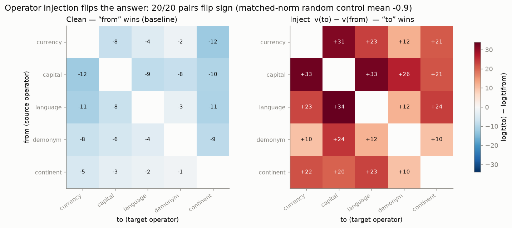

# Causal operator–operand factorization in the residual stream of LLMs

*Subtitle: relational computation as declension — the model marks concepts by their functional
role. The case metaphor is our explanatory device; the claims below stand on the causal
interventions and the measured factorization.*

[:material-file-document: Download the PDF](assets/paper.pdf){ .md-button .md-button--primary }
[:material-play-circle: Interactive explorer](explorer.md){ .md-button }

*Draft, 2026-07-10. Qwen3-1.7B/8B + Gemma-2-9B. All numbers reproducible from `scripts/` and `data/`; see
["How to reproduce"](reproduce.md) and the [working findings log](findings.md). An
[interactive explorer](explorer.md) animates the three central results (declension, injection,
syncretism) and, for readers new to grammatical case, explains the linguistic analogy.*

## Abstract

How do language models represent a relational operation — *currency-of*, *capital-of* — as distinct
from the entity it applies to? Across Qwen3-1.7B/8B and Gemma-2-9B, we find the operation is carried by
a **manipulable operator direction** in the residual stream, largely **separable from the operand**: a
two-way analysis of variance factorizes the mid-network state as `H ≈ μ + operand + operator +
interaction`, ~90% additive, with the operator component dominant at the query position. The direction
is **causal**: adding `v(op_B) − v(op_A)` flips the target-vs-source logit margin for **all 20 ordered
relation pairs in all three models** (a single mid-workspace layer suffices), while matched-norm random
controls do nothing — and a query-position activation patch reroutes the greedy answer itself at the
model's competence ceiling. It **generalizes**:
directions built on half the operands flip the held-out half; directions built in one wording of a
relation transfer to re-framed and fully re-lexicalized prompts; and the operation is separable from its **surface realization** —
*language-of* and *demonym-of* are distinct directions even though both emit "Italian". The
factorization is **specific to relational retrieval**: under the identical pipeline, arithmetic and
comparison-logic operators show 2–4× the interaction and fail held-out generalization. Relational
computation in these models is, to a first approximation, an operand plus a transplantable operator.

## 1. Introduction

A line of work shows that a *task* or *relation* can be captured by a single addable vector in an LLM's
residual stream (task vectors, Hendel et al. 2023; function vectors, Todd et al. 2024) and that many
relations are approximately linear operators (LRE, Hernandez et al. 2024; Merullo et al. 2024). What has
not been characterized is the **joint structure of operator and operand**: whether the operation
*factorizes* from its argument, whether that factorization *generalizes*, whether the operation is
separable from the *word it produces*, and whether any of this holds *beyond* relational facts, in
arithmetic and logic. We answer these on Qwen3 and Gemma-2. A closing discussion (§5) offers a morphological reading —
relational computation as **declension** — as an organizing metaphor for the asymmetries we observe.

## 2. Related work and what is new here

**Extracting relational concepts.** The closest prior work is Wang et al. (2024), who locate hidden
states that express a relation separately from its subject, transplant these relational representations
between subjects, and rewrite relations across 22 relation types and several models. We instead
characterize the **joint geometry** of relation and entity: we quantify its additive and interaction
components (the two-way ANOVA with a measured fusion term), run exhaustive all-pairs swaps against
matched-norm nulls, and test whether relation directions generalize causally across held-out entities,
prompt contexts, architectures, and task domains — including the domains where the factorization fails.

**Operation as an addable vector.** Task Vectors (Hendel et al., EMNLP 2023) and Function Vectors (Todd
et al., ICLR 2024) extract one vector per ICL task and add/patch it to trigger the task. In-Context
Vectors (Liu et al., ICML 2024) and ActAdd (Turner et al. 2023) steer a task/style similarly. These
bundle operator *and* operand into one unfactored "task" direction and (for FVs) show *partial*
cross-task arithmetic without null controls. We contribute the **factorization** (operator ⊕ operand),
an **exhaustive all-pairs swap with matched-norm nulls**, and a **held-out-operand generalization** test.

**Relation as a linear operator.** LRE (Hernandez et al., ICLR 2024) fits a full affine map `W·s + b` per
relation. That represents the relation as a *monolithic* operator; we show an **additive
operator *direction*** that is arithmetically composable and **factorable from the operand**, and we
quantify the operand/operator/interaction variance split, which LRE does not.

**Additive factual recall.** Summing Up the Facts (Chughtai et al. 2024) decomposes factual recall into
additive *circuits* (subject vs relation contributions). Ours is a **representational two-way ANOVA of
the residual state** with an explicit, measured **interaction/fusion term** — a different object.

**Attribute subspaces / reading position.** RAVEL (Huang et al., ACL 2024) disentangles multiple
*attributes of one entity* into subspaces (operators sharing an operand); we measure the orthogonal axis,
**operator vs operand**. The operand→operator shift along the sequence restates the subject-enrichment →
attribute-extraction dynamics of Geva et al. (EMNLP 2023) in operator/operand terms — our least novel point,
included as confirmation.

**Global workspace and the Jacobian lens.** Gurnee, Sofroniew, Lindsey et al. (2026) introduce the
Jacobian lens and identify a mid-depth "global workspace" band of the residual stream. We adopt their
depth band as the site of intervention and their lens as scaffolding; our contribution is orthogonal —
the operator/operand structure of what that band *holds* — and we additionally report a controlled null
on the lens's readout advantage for our task (§4.8).

**Arithmetic and logic.** Arithmetic in LLMs is reported as a "bag of heuristics" (Nikankin et al. 2025)
and Fourier/helical procedures (Nanda et al. 2023; Zhong et al. 2023; Kantamneni & Tegmark 2025), with the
operand *value* cleanly linear (Gurnee & Tegmark 2024). Truth is a steerable direction (Marks & Tegmark
2023) and logical-operator heads exist (Hong et al. 2024). No prior work reports a **cross-domain
operator/operand factorization**; we provide one and show it **breaks down** for arithmetic and logic —
itself a result.

**What is new here is the combination, not any single ingredient.** That relations admit addable
vectors (task/function vectors) and linear decoders (LRE) is established; what has not been done is the
joint, quantified analysis: (1) an operator ⊕ operand **factorization of the residual state itself**
(two-way ANOVA with a measured interaction/fusion term and operator/operand subspace angles); (2) an
**exhaustive all-pairs causal swap** with matched-norm nulls; (3) **held-out-operand generalization** as
the test separating a transferable direction from interpolation among build examples; (4) the
**operation-vs-realization dissociation** (language ≠ demonym as directions despite identical output);
and (5) a **cross-domain test** showing the factorization is specific to relational retrieval and breaks
down for arithmetic and logic. The declension/case reading is our *presentation* of these measurements —
an organizing metaphor that anticipates the observed asymmetries (syncretism at the exponent, fusion in
the interaction term) — not an additional empirical claim.

## 3. Method

**Setup.** Qwen3-1.7B/8B throughout, plus Gemma-2-9B for the cross-architecture replication (§4.5); all
run in bf16 on a single AMD Strix Halo APU (environment details in the supplementary repository). A relation is rendered into a template; the canonical frame is
`"The {op} of {a} is"`, and §4.4 additionally uses two paraphrase frames (question–answer and
discourse-prefixed) that hold the `{op} of {a}` unit fixed while varying the surrounding frame, all
ending in *is* so answer scoring is comparable.
Reading position is the query token unless stated; the depth "workspace" band (38–92% of layers) is where
the J-space paper locates the global workspace and where we build operator directions.

**Operator direction.** For operator `k`, `v(k) = mean_operand[ h(operand, k) − mean_op h(operand, ·) ]`
at the workspace layers — the deviation of an operator from the operand's average over operators, averaged
over operands (the function-vector construction; implementation details in Appendix A).

**Swap and controls.** Efficacy of `k_A → k_B` is the change in `logit(answer_B) − logit(answer_A)` at the
query position when `α·(v(k_B) − v(k_A))` is added over the band, versus a **matched-norm random**
direction. Answers are scored by their distinguishing token (bare digit for arithmetic, since Qwen3
splits " 3" into [space, 3]); a tokenization guard drops, within each operator pair, the operands whose
two answers collide at that token (for relations this leaves 4 of 12 operands on the syncretic
demonym↔language pairs and all 12 elsewhere).

**Factorization.** `H[operand, operator] = μ + operand(o) + operator(k) + interaction`; we report the
variance share of each term and the principal angles between the operand- and operator-subspaces
(Appendix A).

**Generalization.** Build `v(op)` from half the operands; test the swap on the held-out half. This
distinguishes a genuine operator from interpolation among the examples used to build it.

**Statistical treatment.** The 20 ordered swaps are **not** 20 independent observations: they are built
from 5 operator directions (each participating in 8 ordered pairs) and evaluated on the same shared
operand set (12 operands, 4 on the syncretic pairs after the tokenization guard).
We therefore report cluster-bootstrap percentile intervals (10,000 replicates) at two levels. Within a
pair, the **operand** is the resampling unit (per-pair 95% CIs). Across the paradigm, the **operator** is
the top-level cluster: a dyadic node bootstrap resamples the operator set with replacement, weights each
ordered pair by the product of its endpoints' multiplicities, and resamples operands within surviving
pairs (per-operand values are released as long-form artifacts; Appendix A).

**J-space controls.** We repeat readout-geometry in the J-lens readout `unembed(J·h)` vs the logit-lens
readout `unembed(h)`, and re-run efficacy with **spectrum-matched random-projection** and
**permuted-vocabulary** null lenses (Appendix B).

## 4. Results

### 4.1 Relational operators are manipulable directions

All 20 ordered operator swaps flip the **target-vs-source logit margin** (the sign of
`logit(answer_B) − logit(answer_A)` at the distinguishing token; mean swap **+21** logit units on 1.7B,
**+25** on 8B) while
the matched-norm random control is ~0. Representative (1.7B):

| swap | clean | +operator | +random |
|---|---:|---:|---:|
| currency → capital | −7.9 | **+31.5** | −1.2 |
| capital → currency | −12.0 | **+33.0** | −2.5 |
| capital → language | −8.5 | **+32.5** | +3.0 |
| continent → language | −1.9 | **+23.0** | +1.4 |

*Injecting the operator difference `v(to) − v(from)` flips every one of the 20 ordered pairs: clean (left,
"from" wins, blue) → swapped (right, "to" wins, red). The matched-norm random control moves nothing.*

Under the operator-level cluster bootstrap (§3, the level that respects that pairs share directions), the
swap−random contrast is **+22.6, 95% CI [+14.0, +32.1]** at 1.7B and **+26.0 [+17.9, +32.8]** at 8B; the
flip fraction is **1.00 [1.00, 1.00]** at both scales — every replicate flips every pair. Per-pair
operand-bootstrap CIs never cross zero:

*Every ordered swap, with uncertainty. Orange dots = per-operand swap values (median 12/pair; the
tokenization guard leaves 4 for the syncretic demonym↔language pairs); gray × = matched-norm random
control; black bar = operand-bootstrap 95% CI; blue ○ = clean baseline mean. The weakest effects are
precisely the syncretic pairs (`demonym ↔ language` and swaps into `demonym`) — where the two operations
share their surface form.*

**Dose–response and collateral cost.** Sweeping the intervention strength α (1.7B) separates the effect
into its parts: the **operator-specific** component (swap − random) rises and **saturates at ≈+23 by the
default α = 4**, while the matched-norm random control contributes a **nonspecific** margin shift of
≈+6 that is flat in α — any large perturbation degrades the clean answer's dominance somewhat, which is
why all headline numbers are swap − random contrasts. The intervention is *answer*-surgical, not
*distribution*-surgical: with the same hook active on unrelated WikiText, per-token KL(clean ‖
intervened) grows from 7.9 nats (α = 0.5) to 21 nats (α = 12) — 18.4 at the default — so the band-wide
edit substantially distorts off-task text. We report this as an honest cost of the band-wide,
all-position intervention rather than tuning it away; targeted (single-position) variants are the
natural mitigation and are left to future work.

**Minimal intervention, and margins vs. generation.** The band-wide injection is not the minimal
effective intervention: restricting the same directions to a **single mid-workspace layer** still flips
**20/20 margins** (contrast +6.8 [+3.0, +8.9]) at 4.5× lower off-task cost (KL 4.6 vs. 20.6 nats/token);
the middle half-band gives +12.8 [+7.9, +16.3] at 10.9 nats. Greedy decoding sharpens the picture: the
additive injection — at any width — flips the *relative* margin but does not make the model emit the
target answer within three greedy tokens (0% exact match; consistent with its off-task distortion),
whereas **replacing the query-position residual with a real donor activation** (same operand, target
relation — classic activation patching: one position, no averaged direction) makes the model *say* the
target answer at **51%**, essentially its own clean-prompt accuracy of 53%. The averaged difference
direction manipulates preference; the state-level patch reroutes the generated answer at the model's
competence ceiling.

### 4.2 The representation factorizes into operator ⊕ operand

Two-way ANOVA at a mid-workspace layer (1.7B / 8B):

| read position | operand | operator | interaction (fusion) |
|---|---:|---:|---:|
| query token | 5% / 6% | **86% / 82%** | 9% / 13% |
| entity token | **59% / 55%** | 31% / 34% | 9% / 11% |

~90% additive; operand and operator components occupy distinct subspaces (principal angles 41–85° at the
query token, all three models — though near-orthogonality is the high-dimensional default, so the load-
bearing evidence is the variance decomposition and the causal swaps, not the angles). The operation-
dominant representation **emerges along the sequence**: the entity enters operand-dominant and is
*declined* into an operator-marked form by the query position (the reading-position control rules out
template echo; the causal swaps are the stronger control).

![PCA of the 60 workspace vectors H[operand, operator], colored by operator. At the country token the cases intermix (operand-organized, stem 59%); at the query token they separate into clean case clusters (operator-organized, case 86%). The faint web links each country's five case-forms — short at the country token, splayed at the query token. Bottom: the variance split, 1.7B and 8B.](figs/op_geometry.png)

*Where operand and operator live. Colored by operator throughout: at the **country token** the colors
intermix (the cloud is organized by operand); at the **query token** the same points separate into five
case clusters. Each country's five case-forms (faint web) start together and are pulled apart — the
concept is **declined** along the sequence.*

### 4.3 Operation ≠ realization (syncretism)

*language-of* and *demonym-of* emit the **same word** (Italian) yet are **distinct operator directions**;
the swap between them is weak precisely because they share an exponent. A **pure desinence** built from
the shared-output pairs (`mean[h(language) − h(demonym)]`, exponent cancelled) still installs the relation
causally (1.7B: −3.6 → +12.5). The syncretism appears at the *exponent* level, not the *case* level — as
in Latin declension.

*Operation ≠ realization. Every operator is a distinct direction — including language and demonym (boxed),
which emit the identical word "Italian". A desinence built precisely where the two **share** their output
word (so the word cancels) still installs the relation: the case is separable from the word that realizes it.*

### 4.4 Operators generalize to held-out operands and across prompt frames

**Held-out operands.** `v(op)` built on 6 operands and applied to the 6 held-out operands still flips
**20/20** swaps — a genuine, transferable operator, not interpolation. Operator-level cluster bootstrap
on the held-out contrast: **+20.0 [+10.8, +29.5]** at 1.7B, **+22.8 [+14.0, +31.0]** at 8B; flip
fraction **1.00 [1.00, 1.00]** at both.

**Cross-frame transfer.** To rule out template echo we render every relation in
three paraphrase frames — declarative (`The {op} of {a} is`), question–answer (`Q: What is the {op} of
{a}? A: It is`), and discourse-prefixed (`It is well known that the {op} of {a} is`) — and test every
build→test frame combination: `v(op)` built on frame *i*, all-pairs swap run on frame *j*. On 1.7B, **all
9 combinations flip 20/20** (180/180; off-diagonal transfer 120/120, mean contrast **+24.2**), and the
contrast is *frame-invariant to two decimals*: directions built on the declarative frame produce +22.6 on
all three test frames. The clean baselines do shift across frames (−7.0 / −8.1 / −7.9), confirming the
frames are genuinely different prompts; the operator's causal effect does not. At 8B the pattern
replicates — **100/100 flips over the tested combinations (80/80 cross-frame, mean contrast +28.7)**,
with the declarative-built direction again frame-invariant (+26.0 / +26.0 / +26.0). The operator
direction is invariant to the prompt **context** around the fixed `{op} of {a}` unit.

**Cross-lexicalization transfer.** The stronger question is whether the direction survives changing the
*wording of the relation itself*. We re-lexicalize every relation — *currency of {a}* → *money used in
{a}*, *capital of {a}* → *seat of government in {a}*, *language of {a}* → *language primarily spoken in
{a}*, *demonym* → *name for someone from {a}*, *continent of {a}* → *world region containing {a}* — and
test both transfer directions. Directions built on the of-phrasings flip the re-lexicalized prompts, and
vice versa: **40/40 at 1.7B (mean contrast +21.7) and 40/40 at 8B (+26.8)**, with transfer contrasts
indistinguishable from within-formulation ones (1.7B: +22.59 transferred vs. +22.62 within;
operator-level 95% CIs overlap almost exactly). The clean baselines differ across formulations — the
prompts are genuinely different — but the operator's causal effect does not. The direction is a property
of the **relation**, not of its wording.

### 4.5 Cross-architecture replication (Gemma-2-9B)

The entire pipeline transfers unchanged to **Gemma-2-9B** — a different pretraining corpus, tokenizer
(SentencePiece; answer single-token coverage 0.95), and architecture family (soft-capped logits, GQA):

| measure | Qwen3-1.7B | Qwen3-8B | **Gemma-2-9B** |
|---|---:|---:|---:|
| all-pairs swap contrast | +22.6 [+14.0, +32.1] | +26.0 [+17.9, +32.8] | **+30.4 [+23.8, +34.8]** |
| flips (swap > 0) | 20/20 | 20/20 | **20/20** |
| held-out-operand contrast | +20.0 [+10.8, +29.5] | +22.8 [+14.0, +31.0] | **+26.6 [+20.6, +33.2]** |
| operator variance @ query | 86% | 82% | **84.8%** |
| interaction (fusion) | 9% | 13% | **6.8%** |
| pure desinence (clean → +v) | −3.6 → +12.5 | −2.9 → +8.1 | **−3.0 → +8.5** |

Every qualitative signature replicates — all-pairs flips with matched-norm nulls ≈ 0, held-out-operand
transfer, case-dominant factorization at the query token with single-digit fusion, the along-sequence
shift (stem 37.6% → 8.4% from the entity token to the query token), and the exponent-free desinence.
Raw logit units are not directly comparable across architectures (Gemma-2 soft-caps its final logits),
so cross-model comparison should lean on the flip rates and variance shares, which match or exceed
Qwen3's. The operator–operand factorization is not an idiosyncrasy of one model family.

### 4.6 The factorization is domain-specific (arithmetic and logic do not, under our setup)

Extending the identical pipeline to arithmetic (+, ×, −) and comparison-logic operators, on 1.7B:

| domain | operator variance | interaction (fusion) | held-out generalization | swap vs random |
|---|---:|---:|---|---|
| **relational** | 86% | 9% | **20/20** flip | +21 vs ~0 |
| **arithmetic** | 55% | 23% | 2/6 (≤ random) | +0.4 vs +0.3 |
| **logic (compare)** | 33% | 34% | 2/6 (≤ random) | +1.2 vs +0.2 |

The gradient replicates and sharpens at **8B**: relational held-out generalization 20/20 (interaction
13%); arithmetic interaction 25%, held-out 1/6; logic interaction 45%, held-out **0/6** (swap below
random). Monotone at both scales: relational ≫ arithmetic > logic.

Relational operators factorize cleanly and generalize; arithmetic and logical operators are **entangled
with their operands** (2–4× the interaction) and do **not** form a transferable direction — consistent
with arithmetic being a bag of heuristics / Fourier computation rather than a linear operator. The
**held-out generalization test is what separates** a transferable operator direction from memorized
interpolation.

### 4.7 Reconciling with a contrary report: add-N vs. two-operand arithmetic

Christ et al. (2025) report the *opposite* sign for arithmetic: an operator built from an **add-N**
relation (a fixed addend `N` applied to a single number) **does** generalize to held-out relations. The
two results do not conflict — they cut arithmetic along different axes. In add-N the operator **is the
addend `N`** over one numeric operand, so "generalizing across `N`" is interpolation along the number
line (the operand *value* is itself linear; Gurnee & Tegmark 2024), not transfer of a *function*. Our
`+ × −` cut varies the **function** over two operands. Running both cuts on Qwen3
(`op_core.py --domain arith_addN` vs `arithmetic`; `scripts/operator_collinearity.py`) places add-N
exactly between relations and the genuine-function cut:

| cut | held-out generalization (1.7B / 8B) | operator-set collinearity (top-1 var) |
|---|---|---:|
| relations (5 operations) | 20/20 · 20/20 | 0.39 (spread paradigm) |
| **add-N** (operator = addend) | 5/12 · 6/12 (+0.10 / +0.05) | **0.76 (most 1-D / number-line)** |
| `+ × −` (operator = function) | 2/6 · 1/6 (−0.43 / −0.55) | 0.64 |

add-N generalizes **better** than `+ × −` (positive vs. clearly negative) and its operator directions are
the **most collinear** of the three families — 76% of the operator-set variance on a single line —
consistent with add-N being a linear numeric family rather than a set of distinct operations. This
reproduces Christ et al.'s positive (their cut varies a linear parameter) alongside our negative (ours
varies the function) with no contradiction. The caveat is quantitative: Qwen3 BPE restricts us to
single-digit results, so the add-N grid is small (5 operands) and its generalization is weak in absolute
terms — the **ordering** (relations ≫ add-N > `+ × −`), not the magnitude, is the claim.

### 4.8 This is causal structure, not a J-space readout advantage

This project began as a replication of the J-space readout claim of Gurnee, Sofroniew, Lindsey et al.
2026, whose "workspace" band we intervene on throughout. Under matched controls — including a
spectrum-matched random projection — the Jacobian-lens readout showed **no advantage** over the logit
lens on any of four comparisons (Appendix B). The structure reported here is **causal** organization of
the residual stream, not a privileged readable subspace.

## 5. Discussion: relational computation as declension

The measurements invite a morphological reading, offered as an organizing metaphor rather than an
additional claim. In a declining language a noun's role is marked by a case ending on a stem — and each
structural feature of a case system has a measured counterpart here. The same stem takes different
endings (one country, five operator directions); the same ending applies across stems (held-out-operand
transfer, §4.4); two cases can share a surface form without being the same case (**syncretism**:
*language-of* and *demonym-of* both emit "Italian", yet are distinct directions and their mutual swap is
the weakest of the paradigm, §4.3); and stem and ending do not compose perfectly (**fusion**: the ~10%
interaction term, §4.2). The exponent-free **desinence** is the metaphor's sharpest prediction — a case
marker stripped of its surface form should still be causally functional, and it is (§4.3). The metaphor
also marks its own limits: arithmetic and logic operators do not decline (§4.6); whatever those domains
use, it is not a case system.

## 6. Limitations

- **Scale and family.** 1.7–9B models from two families (Qwen3, Gemma 2) — both decoder-only
  transformers; no ≥30B model. Relational linearity holds for a subset of relations even in-domain
  (cf. LRE ~48%).
- **Relation coverage.** Five hand-chosen country relations, English-only. Prompt variation covers
  three context frames and a full re-lexicalization of every relation (§4.4); more relations, other
  entity types, and other languages remain open.
- **Arithmetic coverage.** Qwen3 BPE splits multi-digit numbers, so we restrict to single-digit results;
  the arithmetic null is on that regime and at 1.7B/8B, where arithmetic competence is itself limited.
- **Reading-position result** restates known subject-enrichment→attribute-extraction dynamics.
- **No J-space claim.** The readout-geometry difference is 1.7B-specific; the paper stands on the causal
  factorization, not on a J-lens readout advantage.

## 7. Conclusion

An LLM represents a relational operation as a causally manipulable operator direction
that factorizes from the operand, generalizes to unseen operands, and separates the operation from the
word that realizes it — a structure well described as **declension**. This factorization is not universal:
it is clean for relational retrieval and breaks down for arithmetic and logic, whose operators are
entangled with their operands. The structure is causal; it is not a more-readable subspace.

## Appendix A: Reproducibility, stimuli, and implementation details

**Checkpoints and hardware.** `Qwen/Qwen3-1.7B`, `Qwen/Qwen3-8B`, `google/gemma-2-9b`, all bf16 on a
single AMD Strix Halo APU (128 GB unified memory, ROCm PyTorch). Seeds default to 0 and affect only the
random controls; direction building is deterministic.

**Stimuli.** Operands (12 countries): Italy, Japan, Russia, China, France, Germany, Brazil, Egypt,
India, Mexico, Sweden, Turkey. Relations: currency, capital, language, demonym ("word for a person
from"), continent; every (country, relation) cell has a gold one-word answer (e.g. Italy → euro, Rome,
Italian, Italian, Europe); the full grid ships in `data/relations.json`, the lexical reformulations in
`data/relations_lex.json`, and the paraphrase frames in the dataset metadata.

**Answer scoring and selection.** Answers are scored at the first token of `" " + answer`. Within each
ordered operator pair, operands whose two answers collide at that token are dropped (4 of 12 survive on
the syncretic demonym↔language pairs; all 12 elsewhere). Whole-word single-token coverage: 0.92 (Qwen3
BPE), 0.95 (Gemma SentencePiece).

**Directions, interventions, and controls.** `v(op)[layer]` is the mean over (operand, frame) cells of
the op's residual minus that cell's mean over ops, computed at ~25 evenly spaced source layers restricted
to the 38–92% depth band. Interventions add `α · (v(to) − v(from))` at every position of the band
(α = 4 unless swept). The matched-norm control draws one Gaussian vector per layer and rescales the
band-concatenated stack to exactly the injected difference's norm. Clean mean margins
`logit(to) − logit(from)` are ≈ −7 to −8 across models and frames; per-operand values for every
experiment are released as long-form artifacts (`results/ablation/*_long.parquet`).

**Experiment drivers.** `op_core.py` (directions, swaps, ANOVA, cluster bootstraps),
`operator_paradigm.py`, `operator_factorize.py`, `operator_templates.py`, `operator_lexical.py`,
`op_dose.py`, `op_minimal.py`, `op_geometry_dump.py`.

## Appendix B: The J-space readout comparisons

Four readout comparisons on Qwen3-1.7B (8B where noted) asked whether the Jacobian-lens readout exposes
more than the logit lens: bridge-entity pass@k (a tie, drifting toward the logit lens at 8B); a
surface-form logit difference with real competitors (logit lens matches or wins in every depth band); a
grammatical-number probe with Hewitt–Liang selectivity (number decodable at ceiling from *all* lenses —
including a **spectrum-matched random projection**, the decisive control); and the concept-plane
trajectory that motivated the project (the J-lens path is longer on random planes too — a generic
magnitude effect, not a concept channel). A permuted-vocabulary lens control behaves accordingly. The
1.7B readout-geometry difference (cases reorganizing by output form in J-space) does not replicate at
8B and is not relied on. Full tables live in the project's working log.

## References

Christ et al. 2025, *The Structure of Relation Decoding Linear Operators in Large Language Models*, NeurIPS (Spotlight), arXiv:2510.26543 ·
Chughtai et al. 2024, *Summing Up the Facts*, arXiv:2402.07321 ·
Geva et al. 2023, *Dissecting Recall of Factual Associations*, EMNLP ·
Gurnee, Sofroniew, Lindsey et al. 2026, *Verbalizable Representations Form a Global Workspace in Language Models*, Transformer Circuits Thread ·
Gurnee & Tegmark 2024, *Language Models Represent Space and Time*, ICLR ·
Hendel et al. 2023, *In-Context Learning Creates Task Vectors*, EMNLP Findings, arXiv:2310.15916 ·
Hernandez et al. 2024, *Linearity of Relation Decoding in Transformer LMs* (LRE), ICLR, arXiv:2308.09124 ·
Hong et al. 2024, *A Implies B: Circuit Analysis for Propositional Logic*, arXiv:2411.04105 ·
Huang et al. 2024, *RAVEL*, ACL, arXiv:2402.17700 ·
Kantamneni & Tegmark 2025, *Language Models Use Trigonometry to Do Addition*, arXiv:2502.00873 ·
Liu et al. 2024, *In-Context Vectors*, ICML, arXiv:2311.06668 ·
Marks & Tegmark 2023, *The Geometry of Truth*, arXiv:2310.06824 ·
Merullo et al. 2024, *Language Models Implement Simple Word2Vec-style Vector Arithmetic*, NAACL, arXiv:2305.16130 ·
Nanda et al. 2023, *Progress Measures for Grokking*, ICLR, arXiv:2301.05217 ·
Nikankin et al. 2025, *Arithmetic Without Algorithms*, ICLR, arXiv:2410.21272 ·
Todd et al. 2024, *Function Vectors in Large Language Models*, ICLR, arXiv:2310.15213 ·
Turner et al. 2023, *Activation Addition (ActAdd)*, arXiv:2308.10248 ·
Wang, Whyte & Xu 2024, *Locating and Extracting Relational Concepts in Large Language Models*, ACL Findings, arXiv:2406.13184 ·
Zhong et al. 2023, *The Clock and the Pizza*, NeurIPS, arXiv:2306.17844.
