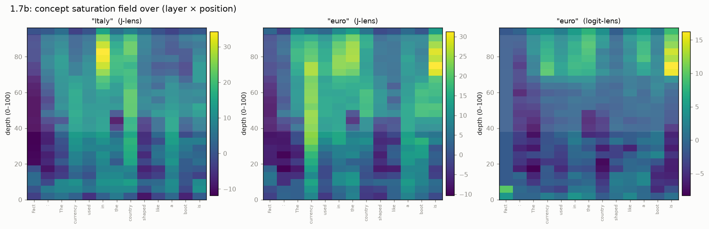
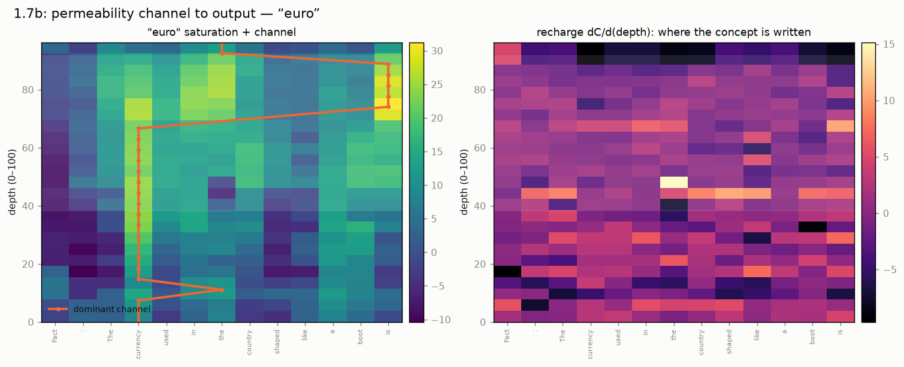

# A reservoir-simulation view

The network has a natural 2D grid: **layers** (depth $\ell$) on one axis, **token
positions** ($p$) on the other — a cross-section, like a reservoir model. This
page reads the J-lens through that lens. It is a framing, not a claim that
transformers *are* reservoirs; each mapping below is marked **computable**,
**partial**, or **metaphor**.

## The mapping

| Reservoir | Transformer |
|---|---|
| **Cell** (pressure, saturation) | activation $h[\ell,p]$ at (layer, position) |
| **Permeability / transmissibility** | the **weights**: attention (position→position) + OV/MLP (read/write of directions) |
| **Flowing fluid** | a **concept**: the residual's component along a J-lens direction |
| **Injector / producer well** | a source token (where a concept enters) / the output position |
| **Advection** | attention **moves** a concept between positions |
| **Accumulation** | the residual connection: each layer **adds** to the stream |
| **Adjoint / sensitivity** | the **Jacobian** $\partial h_\text{final}/\partial h_\ell$ — exactly a history-matching adjoint |

**Key correction:** the weights are *not* the cells — they are the
*transmissibility between* cells. The cells are the activations.

## Saturation field

How much of a concept each cell holds, $C[\ell,p]=\langle J_\ell h[\ell,p], W_U[t]\rangle$.

The answer concept *"euro"* (middle) forms a bright vertical streak on the
`currency` column and concentrates at the output token — a visible channel. The
logit-lens field (right) is far dimmer through the mid-network: without the
Jacobian transport it reads the residual in the wrong basis.

## Permeability channel to the output

The dominant route from source token to producer, and the *recharge* (write-rate
$dC/d\ell$) — which cells pump the concept into the residual highway.

At 1.7B the *"euro"* concept sits on the `currency` column through the workspace
band, then transfers to the output token near the top — a clean channel with
recharge concentrated in a few mid-layer bands.

## Concept flow

## Multiphase analogies

The residual stream carries **many concepts at once** (superposition) through the
**same weights** — so the multiphase-flow vocabulary transfers surprisingly well.

- **Absolute permeability** *(computable)* — the raw conductance of a head/MLP
  path; the sensitivity map above.
- **Relative permeability $k_r$** *(computable)* — concepts share a finite
  bandwidth. Attention softmax weights **sum to 1**, a hard partition of a head's
  "flow budget" among source positions, exactly like saturations summing to one.
  $k_r^c=$ the fraction of an edge's flux carried by concept $c$, as a function
  of its saturation; concepts **compete** ($k_r^A$ falls as $k_r^B$ rises =
  interference), and a concept below threshold stays "connate" (never crosses the
  softmax). Plottable as $k_r(S)$ curves per head.
- **Fingering / channeling** *(partial)* — no literal Saffman–Taylor interface,
  but the *consequences* map: concepts advance along high-permeability streaks
  (the `currency` column), **break through early**, and **bypass** other cells.
  A concept sharply aligned with the output head has high "mobility" and breaks
  through in fewer layers. Measurable as a per-concept **breakthrough depth** and
  a **channeling index**.
- **Injector well** *(computable — this is activation steering)* — adding a
  concept's direction to the residual at a chosen cell *is* an injector. It is
  what [the causal swap](results-causal.md) does, and the paper's
  directed-modulation experiments. One can visualize the **sweep**: inject at a
  cell and watch the concept advect and rise to the output.

!!! note "Why this framing"
    For a reservoir-engineering audience it makes the interpretability concrete;
    and each analogy above corresponds to a real, runnable experiment
    (`scripts/reservoir_field.py`, `permeability.py`, `causal_swap.py`), not just
    a picture. The $k_r(S)$ curves and injector-sweep figures are the natural
    next artifacts.
