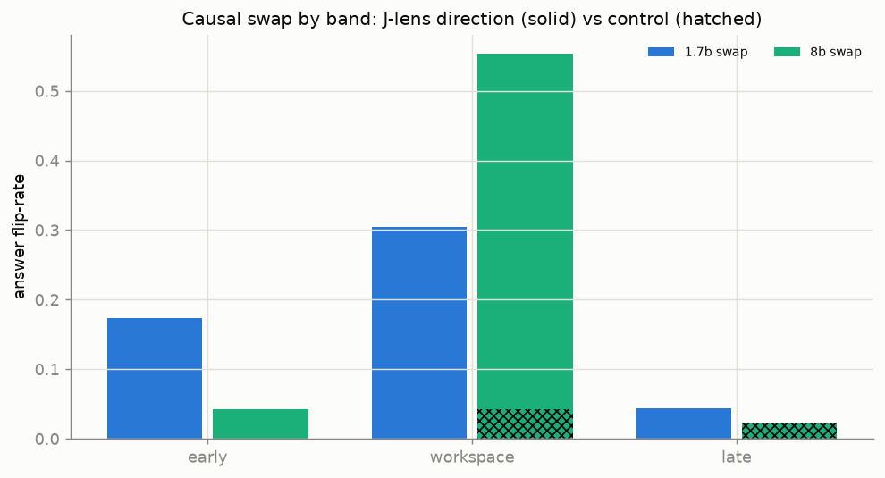
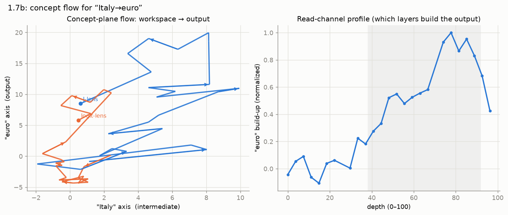

# Results — causal importance

Is the J-space merely *readable*, or does it actually **steer** the computation?
Using the paper's shipped two-hop `probe-swap` set, we move the residual
component along a bridge entity's J-lens direction onto a different entity's
direction, across a layer band, and check whether the model's greedy answer
flips accordingly — against a matched-norm **random control**.

## The workspace band is causally potent — and sharpens with scale

| model | early | **workspace** | late | control | n solved |
|---|---:|---:|---:|---:|---:|
| 1.7B | 0.17 | **0.30** | 0.04 | 0.00 | 23 |
| 8B | 0.04 | **0.55** | 0.02 | 0.04 | 47 |

This is the project's cleanest result. Three things:

1. **The workspace band dominates**, at both scales — exactly where the paper
   locates the workspace.
2. **The control does nothing.** A random direction of identical norm never
   produces the swapped answer, so the effect is specific to the J-lens
   directions, not to perturbation magnitude.
3. **It sharpens with scale.** From 1.7B to 8B the workspace flip-rate nearly
   doubles (0.30 → 0.55) *and localizes*: the early band collapses (0.17 → 0.04),
   so at 8B the workspace is ~14× more causally potent than the early/late bands
   (vs ~2× at 1.7B). The global workspace becomes both stronger and more
   sharply localized as the model grows.

The striking dissociation: this causal structure is strong *before* any readout
advantage appears (see [scale](results-scale.md)) — the workspace steers the
two-hop even though the J-lens does not yet out-read the logit-lens on Qwen3.

!!! note "In progress"
    32B (int8) is the third point; the question is whether the workspace
    sharpening continues.

## Channels: workspace → output

A complementary view of *how* a concept reaches the output. For a two-hop probe
we project the residual — transported into the final basis by the J-lens — onto
a 2D plane spanned by two concept tokens (the intermediate and the answer), and
trace the path layer by layer.

- **Right — read-channel profile.** The build-up of the answer concept along
  depth: it climbs steeply *through the workspace band* and peaks late — this is
  literally which layers assemble the output.
- **Left — concept-plane flow.** The J-lens path (blue) travels far across the
  concept plane, while the logit-lens path (orange) stays cramped near the
  origin — a visual of why the untransported logit lens *under-reads* the middle
  of the network (see [Method](method.md)).

!!! warning "Metaphor, and a small model"
    Attention mixes positions, so this is a projected trajectory, not an
    autonomous vector field — "streamline" is a visual metaphor for the path.
    At 1.7B the J-lens path is jagged (an immature workspace); the 8B/32B
    versions should be smoother and move more cleanly from the intermediate axis
    to the output axis.
