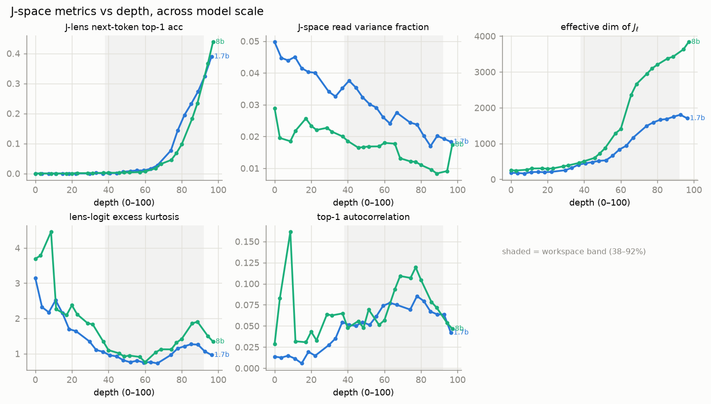
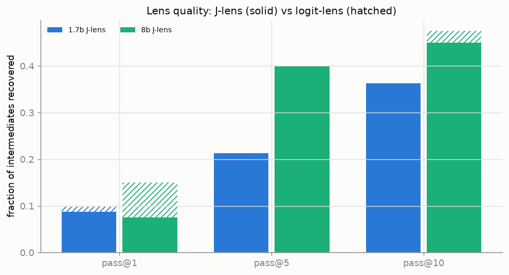
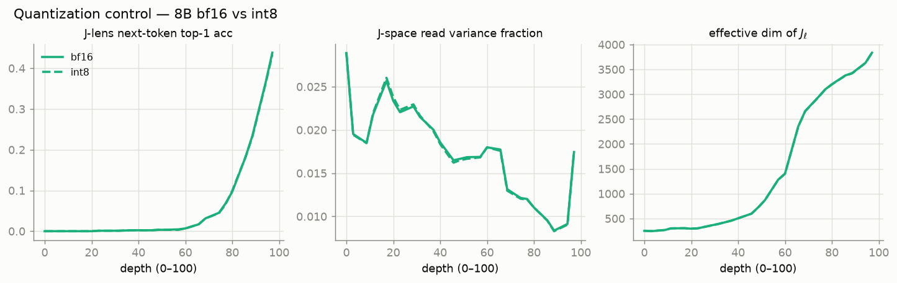

# Results — scale

Does the J-space exist at every scale, or emerge and sharpen with size? We fit
the identical J-lens on Qwen3 1.7B and 8B (32B in progress) and compare per-layer
metrics (reindexed to a 0–100 depth scale) and the paper's pass@k lens-quality
eval.

## Per-layer metrics

The workspace band (38–92% depth) is shaded. Blue = 1.7B, green = 8B.

- **`read_var_frac`** — the J-lens read directions hold a small, *shrinking*
  fraction of residual variance, and it **shrinks further with scale**: the 8B
  curve sits clearly below 1.7B (workspace mean 0.014 vs 0.027). The J-space
  becomes more concentrated / specialized as the model grows.
- **`top1_autocorr`** — readout persistence **peaks inside the workspace band**
  at both scales, the signature of content held across positions.
- **`jlens_top1`** — next-token accuracy stays near zero until the motor regime,
  then rises steeply toward the output, at both scales.
- **`eff_dim`** scales with model width (≈0.5·$d_\text{model}$ at both sizes).

## Lens quality (pass@k)

pass@k = fraction of hidden two-hop bridge entities recovered at lens rank ≤ k.
Here the result is **honest and nuanced**: on our implementation the **J-lens
only ties the logit-lens** at both 1.7B and 8B (at 8B the logit-lens is even
marginally ahead on pass@1/@10). The strong J-lens ≫ logit-lens advantage the
paper reports for Claude does **not** clearly reproduce on Qwen3 at these scales.
Candidate reasons: small eval sample (40 items), a metric-detail difference from
the paper, or an advantage that only appears at 32B. We report it as-is.

## Quantization control (8B bf16 vs int8)

Because 32B is run in int8 (the [48 GB wall](setup.md)), we fit the 8B in *both*
precisions and compare. **int8 preserves the J-space almost exactly:**

| metric | rel. diff (bf16 vs int8) | correlation |
|---|---:|---:|
| `jlens_top1` | 1.0% | 1.0000 |
| `read_var_frac` | 0.8% | 0.9996 |
| `eff_dim` | 0.2% | 1.0000 |
| `kurtosis` | 2.4% | 0.9994 |
| `top1_autocorr` | 6.0% | 0.9785 |
| causal workspace flip | 0.55 → 0.59 | — |

The same held at 1.7B (correlations 0.97–1.00). So the 32B-int8 results are
trustworthy — the quantization confound is at the ~1–2% level on the structural
metrics and negligible on the causal result.

## Takeaway so far

Two dissociated tracks, both now with two scale points:

- **Causal structure** (see [causal](results-causal.md)) is strong and **sharpens
  with scale**.
- **Readout legibility** (pass@k) is the weaker signal and does **not** open a
  gap over the logit-lens on Qwen3 yet.

!!! note "In progress"
    32B (int8) is the third scale point; it will tell us whether the pass@k
    advantage finally emerges at large scale, and whether the causal sharpening
    continues.
