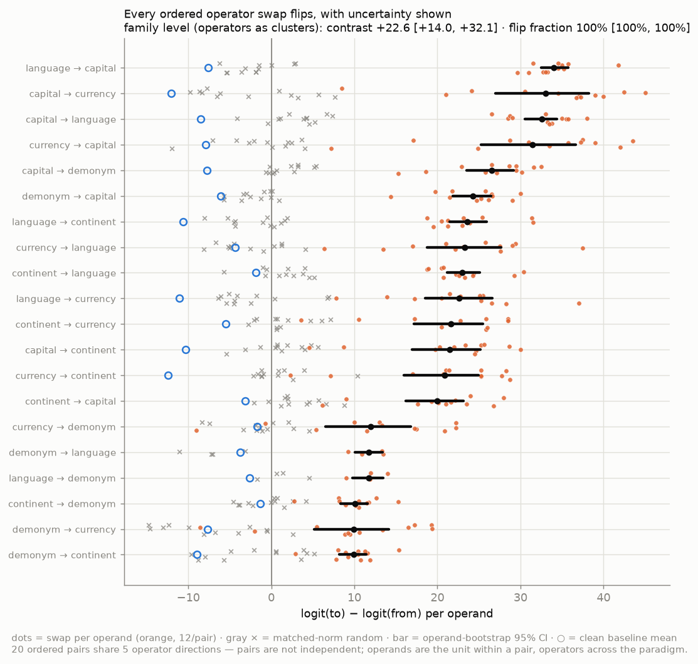
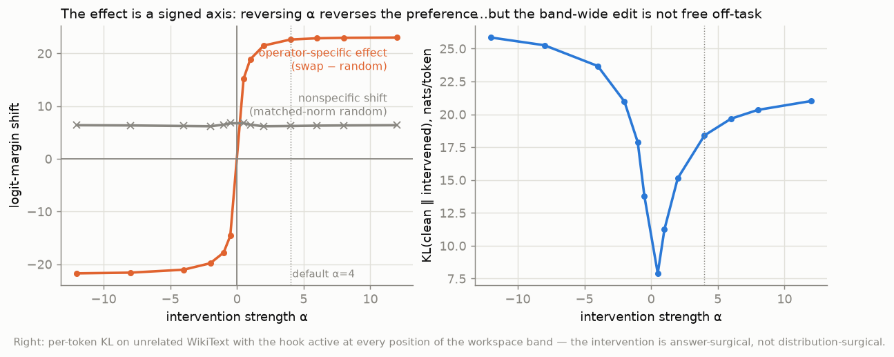

# Evidence & controls

**How to read this page.** Every scientific claim can fail somewhere — the honest question is *where
was this one allowed to fail, and did it?* Each row below puts a claim next to the experiment that tests
it, the control that could have killed it, and the artifact that regenerates it. If you read only one
page beyond the [simple explanation](explained.md), read this one.

Statistical treatment throughout: cluster-bootstrap 95% CIs at two levels (operands within a
pair; **operators** as top-level clusters — the 20 ordered pairs share 5 directions and are *not*
independent observations). Full details in the [paper](assets/paper.pdf).

## Claim → experiment → control → artifact

| # | Claim | Experiment | Control / would-have-killed-it | Artifact |
|---|---|---|---|---|
| 1 | The operator is a **manipulable direction** | all-pairs swap `v(to)−v(from)`, 20 ordered pairs | **matched-norm random direction** ≈ 0 (nonspecific shift +6, flat in dose) | `results/ablation/{model}_relations_operator_swap*.parquet` |
| 2 | Effects are **not noise** | operand-bootstrap CIs per pair; dyadic operator bootstrap for the family | no per-pair CI crosses zero; family flip fraction 1.00 [1.00, 1.00] | `*_long.parquet` + `op_core.bootstrap_*` |
| 3 | The representation **factorizes** (operand ⊕ operator) | two-way ANOVA of `H[operand, operator]` | reading-position control: operand-dominant at the entity token → operator-dominant at the query token (not template echo) | `results/geometry/{model}_relations.json` |
| 4 | The operator **generalizes** | build `v(op)` on half the operands, swap the held-out half | interpolation would fail here; random ≈ 0 | `{model}_relations_heldout*.parquet` |
| 5 | It is **not the prompt frame** | build on frame *i*, swap on frame *j* (3 context frames) | clean baselines shift across frames; the contrast doesn't (1.7B 180/180, 8B 100/100) | `{model}_relations_templates*.parquet` |
| 5b | It is **not the wording either** | full re-lexicalization ("currency of" → "money used in", …), transfer both ways | 40/40 at 1.7B and 8B; transfer contrast ≈ within-formulation (+22.59 vs +22.62) | `{model}_relations_lexical*.parquet` |
| 6 | It is **not one architecture** | identical pipeline on Gemma-2-9B | different corpus/tokenizer/softcap — strongest effects of the three models | `gemma-2-9b_relations_*` |
| 7 | **Operation ≠ realization** | language vs demonym (both emit "Italian"); exponent-free desinence | the shared output word cancels in the desinence, yet it still installs the relation (clean −3.6/−2.9/−3.0 → +12.5/+8.1/+8.5 across the three models) | `results/geometry/*.json` (cosines, desinence) |
| 8 | Factorization is **domain-specific** | same pipeline on arithmetic (+ × −) and comparison logic | held-out generalization *fails* (≤ random); 2–4× interaction — a negative that validates the method's discriminative power | `{model}_{arithmetic,logic}_*` |
| 8b | It is **not one domain** either | full pipeline on a curated animal-taxonomy domain (class/habitat/diet/covering × 12) | 12/12 swaps (+18.1), held-out 12/12 (+18.0 ≡ within), frames 72/72, permuted-label null → 0 (−0.5); interaction 22% ≈ arithmetic's 23% yet transfer perfect → the domain discriminator is transfer, not fusion share | `{model}_animals_*` |
| 9 | The add-N literature **reconciles** | add-N (operator = addend) vs + × − (operator = function) | add-N generalizes better *and* is the most collinear (76% one line) — a linear numeric family, not distinct operations | `*_arith_addN_*`, `operator_collinearity.py` |
| 10 | Intervention effects are **dose-sane** | α sweep 0.5–12 | specific effect saturates at default α=4; off-task KL reported honestly (18 nats — answer-surgical, not distribution-surgical) | `1.7b_relations_dose.parquet` |
| 10b | The band is **not doing the work** | same directions at a single layer; real-activation patch at one position; greedy exact-match | single layer: 20/20 margins at 4.4× lower KL; patch reroutes the *generated* answer at 51% vs 53% ceiling (additive at the default α=4: margins only — resolved as an overdose artifact in row 10d) | `1.7b_relations_minimal*.{parquet,json}` |
| 10c | The factorization is **behaviorally sufficient** — a state *composed* from its parts generates | patch `μ+stem+case` (donor decomposition ladder, 8 variants) at the query position | composed state says the target at 51.8% ≈ real donor 50.9% ≈ clean ceiling 53%; **leave-one-cell-out** parts still 35.7%; **stem-swap redirects the answer to the swapped operand** (34.4% vs 1.8%); interaction term alone 7.1%; magnitude control 4.5% | `{model}_relations_patch_decomp*.{parquet,json}` |
| 10d | Steering **generates at the calibrated dose** — the old ≤0.5% exact match was an overdose | dose × position sweep on greedy generation | inverted-U peaked exactly at the predicted on-manifold dose (band α≈0.1 → **51.3%**; single layer α≈1 → 38.4%); margin keeps climbing past the peak while generation dies (on-task KL 29 nats at α=4) | `{model}_relations_posdose.parquet` |
| 10e | The effect is a **localized edit**, not a global perturbation | additive injection restricted by position (all / query / operand / sentence-initial) × layer scope | query-token-only ≈ all-positions on the margin (+28.7 vs +28.9) at **60× lower off-task KL** (0.29 vs 18.4 nats); operand/wrong positions ≈ 0 | `{model}_relations_positions*.{parquet,json}` |
| 10f | The margin effect is **label-specific** | permuted-relation-label directions (per-operand + global, 20 redraws); random inside the operator subspace | all three semantic nulls → 0 (+0.7 / +0.6 / +0.75, CIs span zero) vs real +22.6; structural probes (wrong layer, other relation, shuffled answers) stay nonzero for mechanistically explained reasons | `{model}_relations_nulls*.{parquet,json}` |
| 10g | Represented early, **causal late** | per-layer sweep: ANOVA share + single-layer swap, direction built and injected at each layer | decodability at ceiling everywhere (locates nothing); operator share peaks at 19% depth, causal contrast at 89% — a 70-point dissociation | `{model}_relations_layersweep*.{parquet,json}` |
| 11 | No privileged **readable subspace** | 4 readout comparisons (pass@k, form, number probe, concept plane) | spectrum-matched **random projection** reads as well as the fitted J-lens; random-plane baseline kills the "channel" | [working log, Part 1](findings.md) |

## The distribution behind the headline

Orange = per-operand swap values (12/pair); gray × = matched-norm random; black bar =
operand-bootstrap 95% CI; ○ = clean baseline. The weakest pairs are exactly the **syncretic**
ones (demonym ↔ language) — where two operations share their surface form, as the declension
reading predicts.

## Dose–response

The operator-specific effect (swap − random) saturates at the default dose; the matched-norm
random control's +6 nonspecific shift is why every headline number is a *contrast*. The
band-wide edit is **not** free off-task (right panel) — reported, not hidden.

## Cross-domain gradient

| domain | operator variance | interaction | held-out | verdict |
|---|---:|---:|---|---|
| relational | 82–86% | 7–13% | 20/20 flip | clean operator |
| arithmetic | 42–55% | 23–25% | ≤ random | bag of heuristics |
| comparison logic | 25–33% | 34–45% | ≤ random | entangled |

Monotone at both Qwen3 scales; the held-out test is what separates a real operator from
memorized interpolation.

*Full evidence trail, including the deliberate nulls: [working log](findings.md). Reproduce
any cell: [How to reproduce](reproduce.md).*
